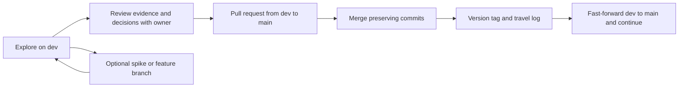
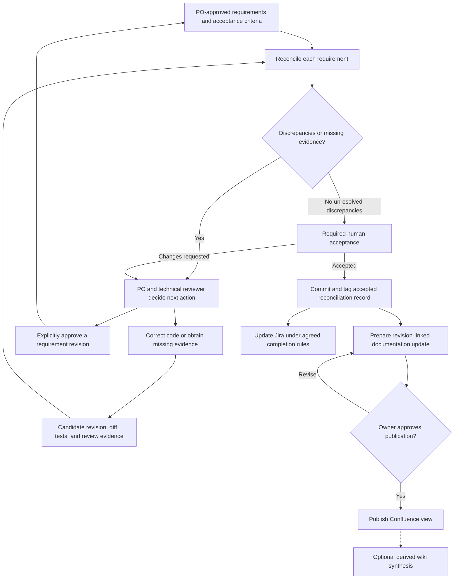

# Adastra

A measurement-first laboratory for multi-agent software development.

## Project objectives

Adastra turns the idea of “Git as the contract” into an explicit, testable workflow. Git identifies the exact code being proposed and accepted. The complete contract also includes approved requirements, specification revisions, constraints, relevant context, test evidence, and acceptance authority.

The project will:
- Reconstruct the observed behavior of an existing application through brownfield analysis.
- Distinguish implemented behavior from intended business requirements.
- Turn a PO's business request into an approved specification and testable backlog.
- Implement changes through isolated roles and versioned handoffs.
- Review changes starting from the diff, retrieving additional context when necessary.
- Measure total cost, human effort, defects, false positives, and rework.
- Compare the proposed process against an ordinary review baseline.

The hypothesis is that structured handoffs and targeted context retrieval improve the cost-quality tradeoff. Savings and reliability are outcomes to measure, not promises.

## Current status

Planning is documented. Laboratory implementation and functional brownfield analysis have not started. Let's Check is the selected real case; its separate local checkout is excluded from this public repository.

The dedicated personal Atlassian site provides Jira and Confluence on Free plans. Environment verification and connector validation are retained in the immutable discovery milestones. Consult Atlassian for current operational status and work priorities.

Day-to-day work management belongs exclusively in Atlassian: Jira holds the backlog, priorities, ownership, status, and blockers; Confluence holds operational plans, procedures, and explanatory documentation. Git remains the versioned record for code, approved deliverables, consolidated decisions, and immutable milestones. This README documents the project and links to Atlassian without duplicating operational work tracking.

- [Work plan](docs/PLAN.md)
- [Decision record](docs/DECISIONS.md)
- [Discovery travel log](docs/TRAVEL_LOG.md)
- [Working agreements](AGENTS.md)

## Workflow

The working branch is `dev`. Each work session ends with verification, a commit of relevant authorized changes, and a push. Local-only work is not a completed delivery. No empty commits are required.

### Branching strategy

| Branch | Purpose |
| --- | --- |
| `main` | Reviewed, reproducible milestones of the complete discovery package. |
| `dev` | Current documentation, hypotheses, tools, and experiments. |
| `spike/<topic>` | Optional short-lived experiment with one question and an explicit stopping criterion. |
| `feat/<topic>` | Optional short-lived branch for a scoped implementation. |

Session closure publishes work to `dev`; it does not automatically promote it to `main`. At a milestone, document the question, method, evidence, results, and limitations, then review together before merging a `dev` to `main` pull request. Preserve individual commits and use a merge commit, not squash. After promotion, fast-forward `dev` to include that merge commit before new work; if it has diverged, reconcile explicitly without force-pushing.

Immutable annotated `step-NNN-short-name` tags identify completed journal milestones, including documentation decisions on `dev`. Annotated `vX.Y.Z` tags identify consolidated package versions on `main`; not every session or milestone needs a version bump. Existing tags remain unchanged. Version `v0.1.0` is a planning baseline, not an application release.

Branch optional spikes and features from `dev`, bring useful results back to `dev`, and retire them after integration. Preserve negative findings in the journal even if experimental code is not retained. Avoid permanent branches per phase, person, or model. `main` contains reviewed, qualified knowledge, not only proven claims: open hypotheses and failed experiments must retain explicit labels.

Every pushed branch is public. Keep confidential case code and evidence outside this repository. The existing default branch remains unchanged.

GitHub protection is enabled for `main`, including administrators: pull requests are required with zero mandatory approvals, force pushes and branch deletion are blocked, and no CI checks are required yet. Signatures, code-owner reviews, and linear history are not required. `dev` remains unprotected. Tag immutability is an operational agreement, not an enforced tag rule. Revisit required CI checks once meaningful tests exist.

## Enterprise tools

### Dedicated Atlassian environment

The dedicated personal Atlassian site contains the Adastra Confluence space and Jira project. Connector validation preceded the Free-plan downgrades; post-downgrade connector behavior has not been tested. Use only demo or explicitly approved public content.

The [Adastra Kanban board](https://voloirex.atlassian.net/jira/software/projects/ADA/boards/1) links to the [Confluence documentation home](https://voloirex.atlassian.net/wiki/spaces/ADA/overview) through Shortcuts, and its Docs view is connected to the Adastra space. Confluence provides the reciprocal board shortcut. Subscription and navigation evidence is recorded in the [discovery travel log](docs/TRAVEL_LOG.md).

Use the supported connector where available and authorized; use the browser when the owner selects that route. Do not create API tokens or custom REST adapters unless a later, approved experiment demonstrates a requirement the connector cannot satisfy. If account flows route to a company organization, or request a paid trial, payment details, or broader scopes, stop and verify the destination and authorization boundary.

### Execution and cost controls

Use Luna 5.6 High for development, Terra for web research, and Astra or Sol for planning and complex reasoning. Avoid additional workers by default and never run two on the same task concurrently. Apply these rules to real project work as well as experiments. Any escalation to a more capable model requires prior owner approval of the plan, rationale, and estimated budget. Unavailable models are a blocker to resolve, not permission for silent substitution.

The portable brownfield procedure requires owner review before the first experiment. Current sequencing and acceptance criteria belong in Jira and Confluence. Minimal local wiki, ticket, and Kanban simulations remain a fallback if Atlassian blocks progress.

[Atlassian Free plans](https://www.atlassian.com/software/free) provide the account entry point. No paid trial is needed for the initial experiment.

## Documentation and work tracking

[Confluence](https://voloirex.atlassian.net/wiki/spaces/ADA/overview) is the primary operational documentation home. [Jira](https://voloirex.atlassian.net/jira/software/projects/ADA/boards) tracks actionable work and current status. Link durable Atlassian records to the relevant Git revision and keep confidential case material outside all public systems.

This README provides repository orientation and the current consolidated baseline. The linked plan and decisions preserve versioned deliverables; the travel log records completed immutable milestones, not day-to-day activity. Avoid duplicating live Jira status or maintaining competing operational narratives in Git. Material Atlassian decisions become explicit, owner-reviewed Git updates when they change the accepted project baseline.

Jira and GitHub must advance coherently. A work item that changes repository content is complete only after the relevant revision is verified, committed, and successfully pushed, with the commit or pull request linked from Jira. Conversely, a Jira or Confluence change that alters an accepted requirement or decision must be reconciled into the Git baseline. Failed publication or synchronization remains explicitly pending; neither system may imply completion that the other does not support.

## Skills and evaluation roadmap

The following is a proposed selection, not a claim that these workflows have already run on the case.

The [brownfield procedure and evaluation guide](https://voloirex.atlassian.net/wiki/spaces/ADA/pages/163847) is the operational entry point for the proposal, skill selection, and review records.

| Phase | Skill or procedure | Assessment and current status |
| --- | --- | --- |
| 1: Brownfield | [`brownfield-discovery`](proposals/brownfield-discovery/SKILL.md) | Owner-approved procedure design with separate runtime adapters and an evidence contract. Not installed or behaviorally validated. Reconstruct observed behavior with code evidence, record uncertainty, and separate current behavior from business intent. |
| 2: Requirements clarification | `brainstorming` from Superpowers | Existing skill available locally and inspected. Helps clarify intent and design with the PO; it is not a reverse-engineering or Jira publishing tool. |
| 2: Technical task planning | `writing-plans` from Superpowers | Existing skill available locally and inspected. Decomposes an approved specification into implementation tasks; it does not by itself provide a complete business backlog with epics, stories, and Jira synchronization. |
| 2: Business backlog decomposition | `backlog-decomposition` | Proposed project-specific procedure, not yet implemented. Build on clarified requirements and technical planning, adding story boundaries, acceptance criteria, dependencies, coverage checks, and publication mapping. |

Phase 2 starts after the brownfield baseline is reviewed by the application owner. Assess decomposition by requirement coverage, independently testable stories, missing dependencies, invented scope, and human correction time. A longer backlog is not inherently a better backlog.

### Claude Code compatibility

Superpowers documents support for Claude Code and Codex. Claude Code supports the Agent Skills `SKILL.md` format. This establishes a supported packaging route, not identical behavior across runtimes or a verified run of the locally installed skill revisions.

For the two proposed project skills, keep the core procedure in standard Markdown/frontmatter and isolate tool names, connector operations, shell commands, and model routing in runtime adapters. Before calling a skill compatible, test discovery, invocation, tool permissions, output structure, and evidence quality in both environments using the same inputs. Record the skill revision, model, runtime, and result in the travel log.

Claude Code support does not automatically establish support in every Claude web or hosted cloud environment. Those environments have their own skill-loading and tool-access rules and require a separate check if selected.

References: [Superpowers](https://github.com/obra/superpowers), [Claude Code skills](https://code.claude.com/docs/en/skills).

## Phase 3: Durable knowledge, provenance, and linting

[Karpathy's LLM Wiki gist](https://gist.github.com/karpathy/442a6bf555914893e9891c11519de94f) describes a pattern, not an installable product or a verified skill. It separates source material, a maintained Markdown wiki, and conventions for ingestion, queries, and maintenance. Its lint operation includes finding contradictions, outdated claims, and missing connections.

The following is Adastra's proposed adaptation, not a capability already implemented or guaranteed by that gist. Design the evidence fields before the first brownfield run; evaluate wiki maintenance after phases 1 and 2 produce material.

### What to preserve

"Crystallization" means recording a versioned, qualified statement with evidence and approval status, not declaring permanent truth.

| Record | Required evidence and boundary |
| --- | --- |
| Observed behavior | Case revision, relevant file or symbol, observation method, and supporting test where available. It is not proof of original intent. |
| Business intent | Explicit PO statement, source revision, scope, and acceptance criteria. Inferred intent stays a hypothesis until confirmed. |
| Decision | Rationale, alternatives, constraints, decision authority, and affected requirements and code. Record an explicit rationale, not an imagined account of internal reasoning. |
| Delegated choice | Model and runtime when observable, procedure revision, run reference, delegated scope, resulting proposal, and approval or rejection. Missing metadata remains unknown. |
| Verification | Exact candidate revision, test or review procedure, outcome, and limits. A passing test does not prove every requirement. |
| Change in knowledge | Previous record, new evidence, reason for revision, and replacement link. Preserve earlier decisions as history. |

Use separate fields for claim type (observation, intent, hypothesis, decision), review status (proposed, approved, disputed, superseded), and applicable code/specification revisions. An approved hypothesis is still a hypothesis. Records need stable identifiers and source references; private references must not expose confidential names or content in public reports.

### Authority and publication

Git versions the accepted knowledge snapshot and its links to specifications, code, and evidence. Jira tracks work; Confluence presents explanatory pages. The wiki is a derived, navigable synthesis, not a replacement for source evidence or PO authority. Preserve authorized source snapshots separately; keep confidential material outside this public repository.

Publish approved snapshots to Confluence with their originating revision and page mapping. Link Jira items to the corresponding requirements and evidence. Initially use one-way publication; edits made in Atlassian become explicit change proposals before they alter the accepted snapshot. Publication failures remain visible and retryable without pretending both systems agree.

### Proposed maintenance cycle

Collect authorized evidence → draft linked records → run structural checks → review semantic findings → obtain required approval → commit and tag the accepted snapshot → publish the approved view.

Structural lint checks required fields, identifier uniqueness, resolvable authorized references, and revision links. Add a separate privacy check before publication; automated scanning cannot guarantee the absence of sensitive information. Semantic lint proposes possible contradictions, unsupported claims, and stale interpretations for review. Neither kind proves business truth. Code or specification changes flag dependent records for revalidation; they must not silently rewrite historical decisions.

### Evaluation

Start with a small, owner-reviewed set of records. Seed known missing sources, contradictions, and stale references into isolated test copies. Measure detection and false-positive rates, time until stale knowledge is flagged, source coverage, unsupported assertions, human correction time, and maintenance cost. Test whether a reader can correctly recover what was decided, why, by whose authority, and for which revision. Compare against the same questions using only the existing README and journal.

No wiki service, lint implementation, or new skill has been installed. Confluence is the operational documentation home; this README preserves the consolidated project design. Technical model/run provenance is experimental evidence requested by the owner; it does not change Git authorship or add coauthor credits.

## Reconciliation before documentation updates

An unresolved discrepancy can remain blocked; no loop implies automatic acceptance or unlimited retries. Preserve the original requirement revision when approving a replacement. Failed publication is recorded as pending, not successful synchronization.

Freeze the PO-approved requirement revision and acceptance criteria before implementation. A reconciliation procedure then compares each requirement against the candidate code, diff, test results, and review evidence. Classify it as supported, partially supported, not satisfied, or not verifiable, and identify changes outside the approved scope.

The PO and technical reviewer resolve discrepancies by requesting a code correction or explicitly approving a requirement change. Never rewrite the original request to match the implementation. Preserve the original baseline and decision rationale. Distinguish implemented, integrated, and deployed versions.

Record the accepted reconciliation report in Git. Prepare a revision-linked Confluence update describing actual behavior, limitations, and decisions; the owner approves publication. Update Jira only according to agreed completion rules. Wiki synthesis is optional downstream work, not a prerequisite for reconciliation or a second acceptance authority. Linting, technical verification, and business acceptance serve different purposes.

## Read-only project consultation

Plan an optional Slack interface for questions about approved knowledge and project progress. Start with explicit mentions in an authorized experiment channel, not unsolicited updates. Consult Jira for ticket and epic state, GitHub for code and check evidence, and approved documentation for intent and rationale. Include source links and retrieval time; disclose unavailable or conflicting evidence. Do not equate closed-ticket counts with a reliable completion percentage.

The first version must not change tickets, approve work, or edit knowledge. Restrict source access and answers to content authorized for the audience; channel membership alone does not authorize access to all sources. Verify organizational approval, existing app ownership, permissions, event delivery, and allowed model processing before connecting anything. Possession of a bot token does not establish these capabilities or permissions. Do not disrupt an existing service.

Credentials must stay outside chat, Git, command history, and logs. A future local masked prompt is only an input mechanism, not a complete secret-storage solution. No Slack connection or credential collection has occurred.

## Final package and maintenance expectations

Deliver a reproducible discovery-to-evolution walkthrough, evidence-backed brownfield findings, approved requirements and backlog, reconciliation reports, decision history, publication procedures, and measured results. Include business-readable explanations and technical onboarding paths linking decisions to exact code revisions and checks.

The owner participates in manual semantic review and publication approval. Treat "living documentation" as a maintained process with stale-information detection and revalidation, not a guarantee of automatic perpetual accuracy. Challenge unsupported assumptions and document corrective alternatives.

Public documentation records generalized decisions and safe evidence. Sensitive operational context stays in the ignored local `private/` directory; the case checkout remains separate. Ignoring a folder prevents ordinary staging, but does not encrypt it or back it up. Arrange a separately authorized private backup before relying on local notes for durable retention. This is a decision record, not a verbatim archive of every spoken utterance.
